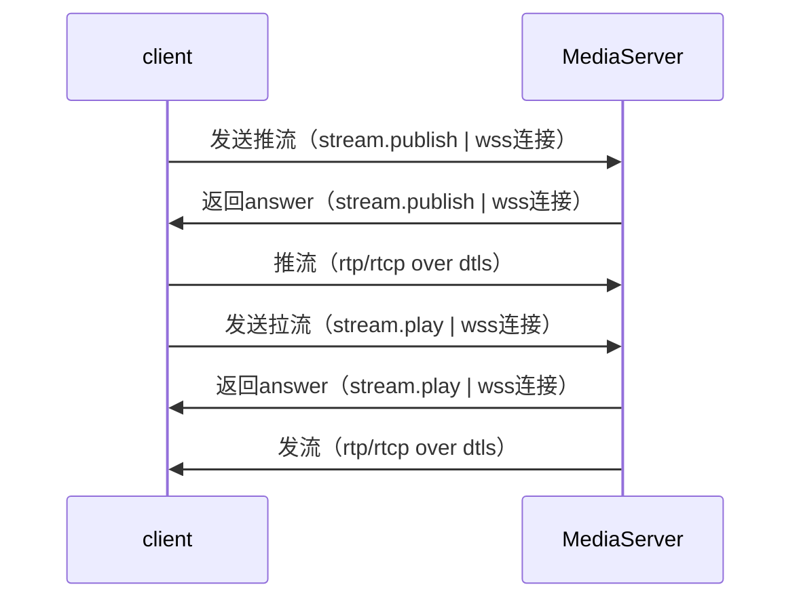

# 接口文档

## 1. 客户端与服务器交互流程



## 2. 客户端与媒体服务器的信令交互文档

### 2.1 说明

- 当前媒体服务器与客户端之间的信令为四个：stream.publish、stream.play、stream.mute、stream.close。

### 2.2 公共头部分

***主动发起端信令的公共头部分***

|     Key     |  ValType  |  Value  |  Explain  |
| :---------: | :-------: | :-----: |:--------: |
| version     | string | 1.0 | 协议版本，1.0 |
| method      | string | stream.publish、stream.play、stream.mute、stream.close | 信令类型，目前有4种 |
| stream      | string | 流名 | 发布流的ID |
| session      | string | 会话ID | 每次wss连接都会分配一个sessionId，后续每次请求都要带上该sessionId |

***示例：主动发起端公共头部分***

``` json
{
    "version": "1.0",
    "method": "xxx",
    "stream": "xxx",
    "session": "xxx"
}
```

***对端回复信令的公共头部分***

|     Key     |  ValType  |   Value   |  Explain  |
| :---------: | :-------: | :-------: | :-------: |
| version     | string  | 1.0 | 协议版本，1.0 |
| err         | int    | 0 或者 非0| 0 成功，非0失败 |
| err_msg     | string | 任意字符串 | 对err的文字描述内容 |
| method      | string | ack | 回复信令 必须是 ack |
| session      | string | 会话ID | 每次wss连接都会分配一个sessionId，后续每次请求都要带上该sessionId |

***示例：对端回复信令的公共头部分***

``` json
{
    "version": "1.0",
    "err": 0,
    "err_msg": "success",
    "method": "xxx",
    "session": "xxx"
}
```

### 2.3 stream.publish （客户端发送SDP）

#### 2.3.1 客户端请求

***stream.publish 关键参数***

|     Key     |  ValType  |  Explain  |
| :---------: | :-------: | :-------: |
| sdp         | string | sdp内容 |
| max_bitrate | uint64_t | 最大码率 |

***stream.publish 示例***

``` json
{
    "version": "1.0",
    "method": "stream.publish",
    "stream": "xxx",
    "session": "", // 第一次请求，没有sessionId
    "data": {
        "max_bitrate": 1000000,
        "sdp": "xxx"
    }
}
```

#### 2.3.2 服务器响应（服务器发送SDP）

***answer 关键参数***

|     Key     |  ValType  |  Explain  |
| :---------: | :-------: | :-------: |
| sdp         | string | sdp内容 |

***answer 示例***

``` json
{
    "version": "1.0",
    "err": 0,
    "err_msg": "success",
    "method": "stream.publish",
    "session": "xxx", // 服务器返回sessionId
    "data": {
        "sdp": "xxx"
    }
}

```

### 2.4 stream.play （客户端发送SDP）

#### 2.4.1 客户端请求

***stream.play 关键参数***

|     Key     |  ValType  |  Explain  |
| :---------: | :-------: | :-------: |
| sdp         | string | sdp内容 |

***stream.play 示例***

``` json
{
    "version": "1.0",
    "method": "stream.play",
    "stream": "xxx",
    "session": "", // 第一次请求，没有sessionId
    "data": {
        "sdp": "xxx"
    }
}
```

#### 2.4.2 服务器响应（服务器发送SDP）

***answer 关键参数***

|     Key     |  ValType  |  Explain  |
| :---------: | :-------: | :-------: |
| sdp         | string | sdp内容 |

***answer 示例***

``` json
{
    "version": "1.0",
    "err": 0,
    "err_msg": "success",
    "method": "stream.play",
    "session": "xxx", // 服务器返回sessionId
    "data": {
        "sdp": "xxx"
    }
}

```

### 2.5 stream.mute （屏蔽视频或音频）

#### 2.5.1 客户端请求

***mute 关键参数***

|     Key     |  ValType  |  Explain  |  Required |
| :---------: | :-------: | :-------: | :-------: |
| video       | bool     | false: 不屏蔽，true: 屏蔽 | 可选 |
| audio       | bool     | false: 不屏蔽，true: 屏蔽 | 可选 |

***mute 示例***

``` json
{
    "version": "1.0",
    "method": "stream.mute",
    "stream": "xxx",
    "session": "xxx",
    "data": {
        "video": false,
        "audio": false
    }
}

```

#### 2.5.3 服务器响应

***mute 关键参数***

|     Key     |  ValType  |  Explain  |  Required |
| :---------: | :-------: | :-------: | :-------: |
| video       | bool     | false: 当前不屏蔽，true: 当前已屏蔽 | 必选 |
| audio       | bool     | false: 当前不屏蔽，true: 当前已屏蔽 | 必选 |

***mute 回复示例***

``` json
{
    "version": "1.0",
    "err": 0,
    "err_msg": "succeed",
    "method": "stream.mute",
    "session": "xxx",
    "data": {
        "video": false,
        "audio": false
    }
}
```

### 2.6 stream.close（关闭流请求）

#### 2.6.1 客户端请求

***关键参数：客户端发起 close***

***无私有参数***

|     Key     |  ValType  |  Explain  |
| :---------: | :-------: | :-------: |
|    |  |  |

***示例：发起 close***

``` json

{
    "version": "1.0",
    "method": "stream.close",
    "stream": "xxxxx",
    "session": "xxx",
    "data": { }
}

```

#### 2.6.2 服务器响应

***示例：回复 close***

``` json

{
    "version": "1.0",
    "err": 0,
    "err_msg": "succeed",
    "method": "stream.close",
    "session": "xxx",
    "data":{ }
}

```

### 2.7 stream.heartbeat 心跳

#### 2.7.1 请求

```json
{
    "version": "1.0",
    "method": "stream.heartbeat",
    "stream": "xxx",
    "session": "xxx",
    "data": { }
}
```

#### 2.7.1 返回

```json
{
    "version": "1.0",
    "err": 0,
    "err_msg": "succeed",
    "method": "stream.heartbeat",
    "session": "xxx",
    "data":{ }
}
```

## 3. 录制

### 开始录制

```json
{
    "stream": "123456",
    "method":"record.start",
    "data": {
        "fileName": "123456-20201123-231523.webm"
    }
}
```

### 停止录制

```json
{
    "stream": "123456",
    "method":"record.stop",
    "data": {}
}
```
